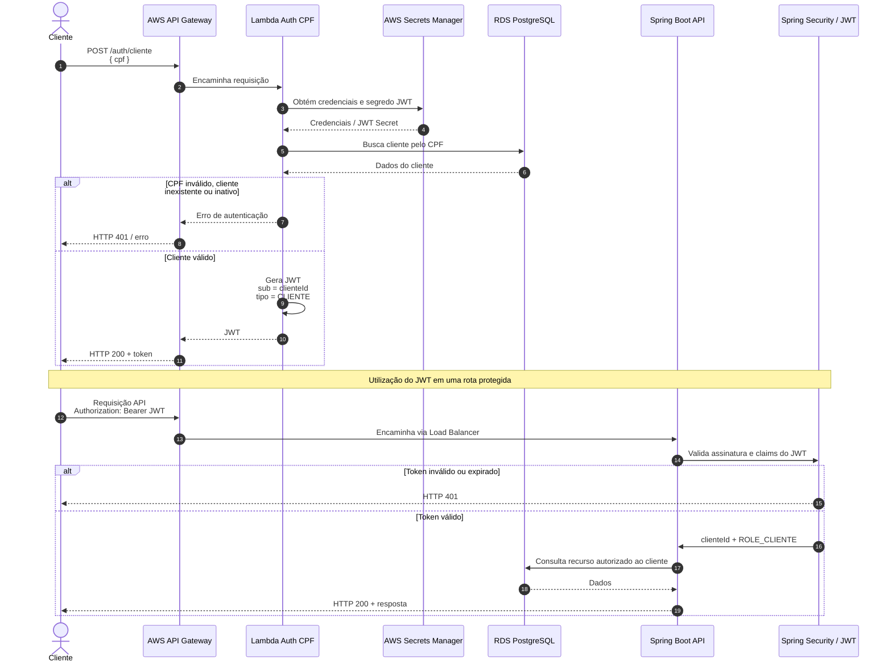

# Diagrama de Sequência — Autenticação do Cliente

## Objetivo

Este diagrama representa o fluxo de autenticação do cliente por CPF e o uso posterior do JWT nas rotas protegidas da aplicação.

## Fluxo de autenticação

## Descrição

O cliente realiza a autenticação através do CPF pelo Amazon API Gateway. A requisição é direcionada a uma AWS Lambda responsável por validar o CPF, consultar o cliente no banco PostgreSQL e, quando autorizado, emitir um JWT contendo a identificação do cliente.

Nas requisições subsequentes, o token é enviado à API Spring Boot, que valida sua assinatura e utiliza a identificação contida no token para realizar a autorização de acesso aos recursos.

No JWT:

- `sub` contém o identificador do cliente.
- `tipo` contém o valor `CLIENTE`.

Dessa forma, a aplicação utiliza a identidade presente no token para validar o acesso aos recursos do cliente, evitando confiar em um `clienteId` informado livremente pela requisição.
