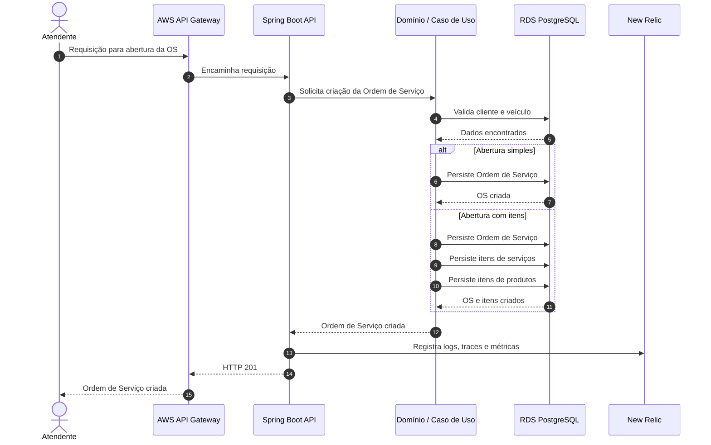

# Diagrama de Sequência — Abertura de Ordem de Serviço

## Objetivo

Este diagrama representa o fluxo de abertura de uma Ordem de Serviço na aplicação, considerando as duas formas disponíveis de criação:

- abertura simples, sem itens de produtos ou serviços;
- abertura completa, já contendo itens de serviços e produtos.

O diagrama também evidencia a participação da API Gateway, da aplicação Spring Boot, da camada de domínio, do banco PostgreSQL e da observabilidade com New Relic.

## Fluxo de abertura da Ordem de Serviço

## Descrição

O processo de abertura da Ordem de Serviço é iniciado pelo atendente por meio da API pública exposta pelo Amazon API Gateway. A requisição é encaminhada para a aplicação Spring Boot, que direciona a operação para a camada de domínio responsável pelo caso de uso de criação da OS.

Antes da persistência, a aplicação valida as informações necessárias, como cliente e veículo. A partir daí, existem duas variações do fluxo:

- **Abertura simples:** a Ordem de Serviço é criada inicialmente sem itens de produtos ou serviços.
- **Abertura com itens:** a Ordem de Serviço é criada juntamente com os itens de serviços e produtos informados na requisição.

Em ambos os casos, os dados são persistidos no PostgreSQL executado no Amazon RDS. Durante o processamento, a aplicação gera logs estruturados, traces e métricas que são enviados ao New Relic para fins de monitoramento e observabilidade.

Após a criação bem-sucedida, a aplicação retorna uma resposta HTTP de sucesso ao atendente por meio do API Gateway.
